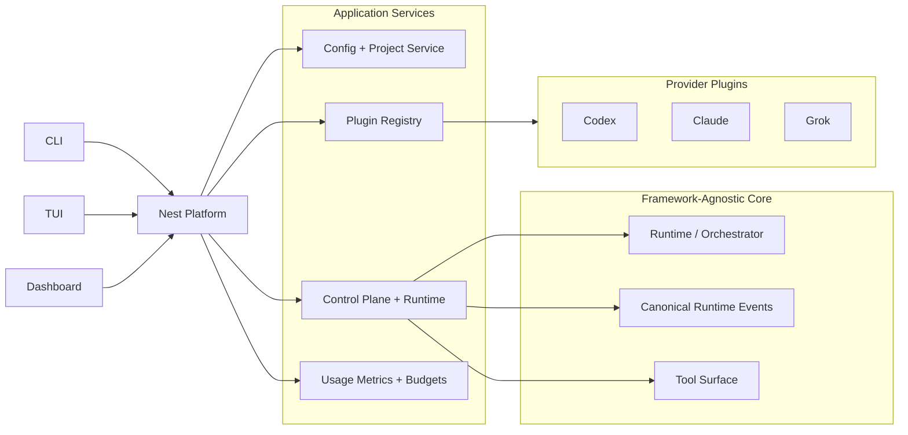

# Maintainers

## Architecture

OrchestrAI now has four primary layers:



## Repo Layout

- `src/plugin-sdk.ts`
  Provider plugin contract.
- `src/provider-registry.ts`
  Built-in and external provider discovery and resolution.
- `src/provider-plugins/*`
  Built-in provider implementations.
- `src/orchestrai-config.ts`
  Config v2 loader, normalizer, and writer.
- `src/config-backed-projects.ts`
  Project CRUD and internal workflow compilation.
- `src/control-plane.ts`
  Shared application service used by CLI, dashboard, and TUI.
- `src/platform-context.ts`
  Nest application-context bootstrap.
- `src/platform-module.ts`
  Nest HTTP/SSE dashboard host.
- `packages/plugin-sdk`
  Workspace package surface for third-party plugin authors.
- `packages/providers/*`
  Workspace package surfaces for built-in providers.

## Core Rules

- Core code must depend on provider interfaces, not provider implementations.
- User-managed configuration lives in `orchestrai.config.ts`.
- `.orchestrai/runtime/projects/*/WORKFLOW.md` is an internal generated artifact.
- Third-party provider discovery is convention-based:
  - `@orchestrai/provider-*`
  - `orchestrai-provider-*`
- Provider packages must export `providerPlugin`.

## Provider Plugin Contract

Provider plugins implement `AgentProviderPlugin` from [src/plugin-sdk.ts](/Users/rafaelvidaurre/Code/Personal/agentic-development/orchestrai/src/plugin-sdk.ts).

Current responsibilities owned by plugins:

- provider id and display metadata
- default model and default options
- model catalog
- session factory
- pricing metadata
- provider-specific validation
- workflow-section compilation for runtime compatibility

Minimum shape:

```ts
export const providerPlugin: AgentProviderPlugin = {
  id: "my-provider",
  displayName: "My Provider",
  defaultModel: "my-model",
  defaultOptions: {},
  listModels() {
    return {
      provider: "my-provider",
      models: [{ value: "my-model", label: "my-model" }],
      source: "static",
      warning: null
    };
  },
  createSession(config, workspacePath, env, logger, onEvent) {
    return new MySession(config, workspacePath, env, logger, onEvent);
  }
};
```

## Config Flow

1. User edits `orchestrai.config.ts` or uses the CLI/dashboard.
2. `ConfigBackedProjectsService` validates and persists config plus project env files.
3. The service compiles internal runtime workflows under `.orchestrai/runtime/projects/*`.
4. `RuntimeManager` still runs those compiled workflows as a compatibility bridge.

This means the repo is already on config v2 for user workflows, but the runtime engine still consumes generated legacy-shaped artifacts internally.

## User-Facing Surfaces

- CLI: [src/cli.ts](/Users/rafaelvidaurre/Code/Personal/agentic-development/orchestrai/src/cli.ts)
- Dashboard API/SSE: [src/platform-module.ts](/Users/rafaelvidaurre/Code/Personal/agentic-development/orchestrai/src/platform-module.ts)
- Dashboard client: [src/dashboard-client.tsx](/Users/rafaelvidaurre/Code/Personal/agentic-development/orchestrai/src/dashboard-client.tsx)
- TUI: [src/tui.tsx](/Users/rafaelvidaurre/Code/Personal/agentic-development/orchestrai/src/tui.tsx)

## Testing

Primary commands:

```bash
yarn check
yarn exec vitest run test/*.test.ts
yarn coverage
yarn build
```

Current direct coverage added for the new architecture:

- `orchestrai-config.ts`
- `provider-registry.ts`
- `config-backed-projects.ts`
- `migrate-legacy.ts`
- `control-plane.ts`
- provider model/pricing/plugin paths

Current gaps:

- CLI command execution is only smoke-tested manually, not via dedicated automated CLI tests.
- Nest HTTP controllers and SSE endpoints are not directly integration-tested.
- Dashboard React client and TUI remain effectively untested in automation.
- Provider session implementations (`codex.ts`, `claude.ts`) still have very low coverage because they wrap real external runtimes.

## Conventional Commits And Releases

OrchestrAI now uses conventional commits plus `standard-version`.

Commit workflow:

```bash
yarn install
yarn commit
```

`yarn install` runs the Husky `prepare` step and installs the `commit-msg` hook. `yarn commit` then launches Commitizen using the conventional-changelog prompt adapter. Non-compliant commit messages are rejected by `commitlint`, even if someone uses plain `git commit`.

Release workflow:

```bash
yarn release:dry-run
yarn release:first
yarn release
```

Run release commands from a clean working tree. `standard-version` will refuse to cut a release if there are uncommitted changes.

- `yarn release:first`
  Use once to establish the initial `0.1.0` release tag and seed automated changelog management.
- `yarn release`
  Bumps the version according to conventional commits, updates `CHANGELOG.md`, and creates the release commit/tag.
- `yarn release:dry-run`
  Shows the computed next release without changing files.

The checked-in `CHANGELOG.md` starts at `0.1.0` and is the public release history going forward.

## Release And Packaging Notes

- The npm CLI entrypoint is `dist/src/cli.js`.
- Public package subpath exports:
  - `orchestrai/config`
  - `orchestrai/plugin-sdk`
- Workspace packages are currently shaped for the future published surface, but built-in providers are still bundled with the main package.

Before publishing:

1. Remove or archive any stale workflow-based setup paths that are no longer intended for public use.
2. Decide whether to keep `private: true` in the root package or split published package metadata.
3. Add dedicated CLI e2e tests.
4. Add HTTP integration tests for Nest routes.
5. Review dashboard/TUI packaging and binary smoke tests on Node 22.

## Migration Guidance

For legacy installations:

```bash
node dist/src/cli.js migrate legacy --root /new/root --from /legacy/root
```

That path is the supported bridge. Direct runtime editing of legacy `WORKFLOW.md` files should be treated as deprecated.
